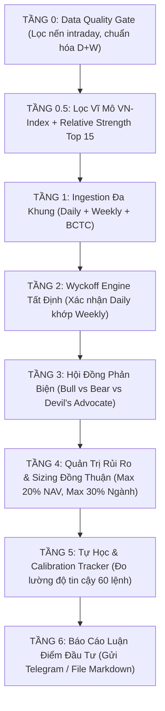

# Quy Chuẩn Vibe Coding: Quant Pipeline V3 & Bài Học Sửa Sai Thực Tế

Kỹ năng này đúc kết toàn bộ kiến trúc **Pipeline V3 (7 Tầng Định Lượng)**, các bài học xương máu và quy tắc lập trình bất biến cho hệ thống giao dịch chứng khoán Việt Nam.

---

## 1. QUY TẮC HIỂN THỊ GIÁ CHỨNG KHOÁN (PRICE FORMATTING RULES)

> [!IMPORTANT]
> **Quy tắc 2 Chữ Số Thập Phân Bắt Buộc (.2f):**
> 1. **Dạng rút gọn (`k`):** Luôn format dạng `f"{price_k:.2f}k"`.
>    - **Số chẵn:** Bắt buộc hiển thị đủ 2 số 0 ở đuôi $\rightarrow$ **`73.00k`** *(Không được viết `73 đ` hay `73k`)*.
>    - **Số lẻ:** Bắt buộc hiển thị đúng $\rightarrow$ **`72.95k`**, **`21.25k`**, **`27.65k`**.
> 2. **Dạng đầy đủ (VNĐ):** Format dấu phẩy hàng nghìn $\rightarrow$ **`73,000 đ`**, **`72,950 đ`**.
> 3. **Hàm quy chuẩn áp dụng toàn hệ thống:**
> ```python
> def format_price_k(price):
>     if price is None: return "N/A"
>     price_k = price / 1000.0 if price > 500 else float(price)
>     return f"{price_k:.2f}k"
>
> def format_price_vnd(price):
>     if price is None: return "N/A"
>     price_vnd = price if price > 500 else price * 1000.0
>     return f"{price_vnd:,.0f} đ"
> ```

---

## 2. CHỐNG BẪY LÀM TRÒN SL / TP (ANTI-ROUNDING BUG)

> [!CAUTION]
> **Nguyên nhân lỗi SL/TP = 100 đ:**
> Khi dữ liệu thô của vnstock ở đơn vị nghìn (VD: VHM = `72.6`), dùng lệnh `round(77.1, -2)` sẽ ép cả số `77.1` và `70.8` thành **`100.0`** vì Python hiểu `-2` là làm tròn đến hàng trăm ($10^2$).

* **Quy tắc bất biến:**
  * **Luôn chuẩn hóa giá về VNĐ (`> 500`)** trước khi áp dụng `round(..., -2)`.
  * Nếu giữ nguyên đơn vị nghìn, chỉ dùng `round(p, 2)`.
  * Target Profit (TP) và Stop Loss (SL) phải phản ánh đúng tỷ lệ mục tiêu (TP $+15\%$, SL $-6\%$ hoặc theo ATR).

---

## 3. QUY CHUẨN HIỂN THỊ DANH MỤC TRÊN TELEGRAM (MOBILE MONOSPACE TABLE)

Màn hình điện thoại có chiều ngang hẹp. Tránh dùng tin nhắn dài dòng nhiều dòng/mã gây rối mắt.

* **Quy chuẩn hiển thị:**
  1. Dùng khối monospace ````text ... ```` để các cột căn thẳng hàng tuyệt đối.
  2. Bảng phải có 5 cột cô đọng: `MÃ`, `KL`, `GIÁ VỐN`, `GIÁ HT`, `LÃI/LỖ`.
  3. Phần mục tiêu bên dưới ghi rõ giá chi tiết: `BSR (HT: 27,200đ | Vốn: 27,650đ) ↳ SL: 25,991đ | TP: 31,797đ`.

```text
MÃ       KL  GIÁ VỐN   GIÁ HT  LÃI/LỖ
────────────────────────────────────
BSR    7.2k   27.65k   27.20k  -1.63%
SSI    9.4k   21.25k   21.30k  +0.24%
```

---

## 4. KIẾN TRÚC PIPELINE V3 (7 TẦNG ĐỊNH LƯỢNG)



---

## 5. BẢN TIN BUỔI SÁNG 9H & BOT TƯƠNG TÁC 2 CHIỀU

1. **Bản tin 9h sáng:**
   - Tự động dịch 100% tin quốc tế (CNBC, Bloomberg, MarketWatch, FT) sang Tiếng Việt.
   - Tóm tắt điểm chính ngắn gọn có số liệu (%, tỷ, điểm).
   - Thứ 2: Quét tin Thứ 7 + Chủ Nhật + Sáng T2 (3 ngày).
   - Thứ 3 $\rightarrow$ Thứ 6: Quét 24h gần nhất.
2. **Bot tương tác 2 chiều (`telegram_bot_interactive.py`):**
   - Hỗ trợ các lệnh: `cập nhật sổ lệnh`, `tin tức`, `quét`, `phân tích <MÃ>`, `menu`.
