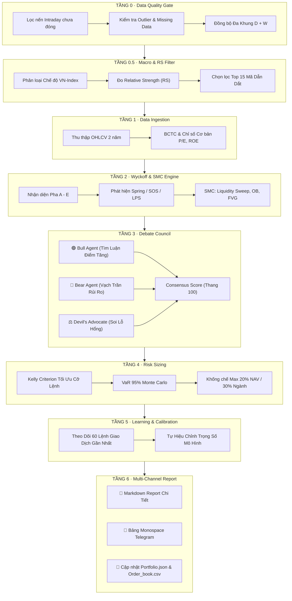

# 🚀 Vibe Stock Analysis · Antigravity Quant Trading Engine

> **Hệ thống phân tích định lượng & giao dịch chứng khoán tự động thế hệ mới cho thị trường Việt Nam (HOSE, HNX, UPCOM).**  
> Kết hợp phương pháp **Wyckoff**, **Smart Money Concepts (SMC)**, **13 Động cơ Toán học & Machine Learning**, **Hội đồng Phản biện 3 chiều (Multi-Agent Debate)**, và **Bot Telegram Tương Tác 2 Chiều 24/7**.

[](https://www.python.org/)
[](https://vnstocks.com)
[](#-ki%E1%BA%BFn-tr%C3%BAc-pipeline-v3-7-t%E1%BA%A7ng-%C4%91%E1%BB%8Bnh-l%C6%B0%E1%BB%A3ng)
[](#-bot-telegram-t%C6%B0%C6%A1ng-t%C3%A1c-2-chi%E1%BB%81u-247)
[](backtest_results_2yr.md)
[](#)

---

## 📑 Mục Lục

- [🌟 Tính Năng Nổi Bật](#-t%C3%ADnh-n%C4%83ng-n%E1%BB%95i-b%E1%BA%ADt)
- [🏗️ Kiến Trúc Pipeline V3 (7 Tầng Định Lượng)](#%EF%B8%8F-ki%E1%BA%BFn-tr%C3%BAc-pipeline-v3-7-t%E1%BA%A7ng-%C4%91%E1%BB%8Bnh-l%C6%B0%E1%BB%A3ng)
- [🧠 13 Động Cơ Toán Học & Machine Learning](#-13-%C4%91%E1%BB%99ng-c%C6%A1-to%C3%A1n-h%E1%BB%8Dc--machine-learning)
- [🤖 Bot Telegram Tương Tác 2 Chiều (24/7)](#-bot-telegram-t%C6%B0%C6%A1ng-t%C3%A1c-2-chi%E1%BB%81u-247)
- [📊 Kết Quả Kiểm Định Lịch Sử (Backtest 2 Năm)](#-k%E1%BA%BFt-qu%E1%BA%A3-ki%E1%BB%83m-%C4%91%E1%BB%8Bnh-l%E1%BB%8Bch-s%E1%BB%AD-backtest-2-n%C4%83m)
- [🛡️ Bộ Quy Chuẩn Kỹ Thuật & Chống Lỗi Thực Nghiệm](#%EF%B8%8F-b%E1%BB%99-quy-chu%E1%BA%A9n-k%E1%BB%B9-thu%E1%BA%ADt--ch%E1%BB%91ng-l%E1%BB%97i-th%E1%BB%B1c-nghi%E1%BB%87m)
- [📁 Cấu Trúc Thư Mục Dự Án](#-c%E1%BA%A5u-tr%C3%BAc-th%C6%B0-m%E1%BB%A5c-d%E1%BB%B1-%C3%A1n)
- [⚡ Hướng Dẫn Cài Đặt & Khởi Chạy Nhanh](#-h%C6%B0%E1%BB%9Bng-d%E1%BA%ABn-c%C3%A0i-%C4%91%E1%BA%B7t--kh%E1%BB%9Fi-ch%E1%BA%A1y-nhanh)
- [📜 Danh Mục Lệnh Tương Tác Bot](#-danh-m%E1%BB%A5c-l%E1%BB%87nh-t%C6%B0%C6%A1ng-t%C3%A1c-bot)

---

## 🌟 Tính Năng Nổi Bật

- **Toàn diện vũ trụ 71 mã cổ phiếu**: Giám sát liên tục các mã chủ chốt thuộc 16 nhóm ngành hàng đầu thị trường chứng khoán Việt Nam (VN30, Ngân hàng, Bất động sản, Thép, Chứng khoán, Bán lẻ,...).
- **Hội đồng Phản biện 3 Chiều (Multi-Agent Debate Council)**: Mỗi cơ hội giải ngân đều phải qua vòng tranh luận gắt gao giữa **Phe Mua (Bull Agent)**, **Phe Bán (Bear Agent)** và **Luật sư của Quỷ (Devil's Advocate)** để loại bỏ bẫy FOMO.
- **Tối ưu hóa vị thế bằng Kelly Criterion & Monte Carlo**: Tự động tính toán điểm vào lệnh (Entry), Cắt lỗ (Stop Loss), Chốt lời (Take Profit) và khối lượng giải ngân (Position Size) không vượt quá 20% NAV/mã và 30% NAV/ngành.
- **Bản tin Tài chính 9h sáng tự động**: Thu thập và biên dịch thông minh tin tức quốc tế (Bloomberg, CNBC, Reuters, WSJ) và thị trường trong nước (CafeF, Vietstock), tóm tắt số liệu cốt lõi gửi tới Telegram trước giờ mở cửa.
- **Trải nghiệm di động tối ưu**: Bảng định dạng Monospace chuẩn tỉ lệ hiển thị điện thoại, chống rối mắt, cung cấp đầy đủ thông số tài khoản và cảnh báo rủi ro tức thì.

---

## 🏗️ Kiến Trúc Pipeline V3 (7 Tầng Định Lượng)

Hệ thống vận hành theo quy trình tuyến tính phân tầng nghiêm ngặt nhằm lọc bỏ nhiễu và đảm bảo chất lượng tín hiệu cao nhất:



---

## 🧠 13 Động Cơ Toán Học & Machine Learning

Toàn bộ logic định lượng được xây dựng trong module `v3_pipeline/ml_algorithms.py`:

| STT | Thuật Toán / Mô Hình | Ứng Dụng Trong Hệ Thống | Cơ Chế Định Lượng |
|:---:|:---|:---|:---|
| **1** | **Logistic Logit & Sigmoid** | Ước tính xác suất thắng thực nghiệm $P(\text{Win})$ | $\sigma(z) = \frac{1}{1 + e^{-z}}$, chuẩn hóa $[0\% - 100\%]$ |
| **2** | **Cosine Similarity Matching** | So khớp mẫu hình nến Wyckoff với vector chuẩn | $\cos(\theta) = \frac{\mathbf{u} \cdot \mathbf{v}}{\|\mathbf{u}\| \|\mathbf{v}\|}$ (Spring, SOS, LPS) |
| **3** | **Linear Regression Channel** | Xác định kênh xu hướng & Mean Reversion | Hồi quy OLS đa khung thời gian |
| **4** | **Z-Score Anomaly Detection** | Phát hiện dòng tiền bất thường & quét thanh khoản | $Z = \frac{x - \mu}{\sigma}$ (Volume / Price Outlier) |
| **5** | **Monte Carlo Simulation** | Ước lượng rủi ro sụt giảm danh mục VaR 95% | Mô phỏng 1,000 kịch bản ngẫu nhiên từ ma trận hiệp phương sai |
| **6** | **Kelly Criterion Fractional** | Tối ưu hóa tỷ trọng phân bổ vốn cho từng lệnh | $f^* = \frac{p \cdot b - q}{b}$ (Áp dụng hệ số an toàn $0.5 \times Kelly$) |
| **7** | **Average True Range (ATR)** | Đặt Stop Loss và Take Profit động theo biến động | $SL = \text{Entry} - k \cdot ATR(14)$, $TP = \text{Entry} + m \cdot ATR(14)$ |
| **8** | **Relative Strength (RS Mansfield)** | Lọc cổ phiếu vượt trội hơn chỉ số chung VN-Index | Tỷ lệ biến động tương đối đa chu kỳ (1M, 3M, 6M) |
| **9** | **Volume Spread Analysis (VSA)** | Đánh giá cung cầu tại các vùng cản then chốt | Tương quan giữa độ rộng nến (Spread) và Khối lượng (Volume) |
| **10** | **Order Block (OB) Detector** | Xác định vùng dòng tiền lớn tích lũy / phân phối | Nhận diện nến đối nghịch trước đợt bứt phá cấu trúc (BOS) |
| **11** | **Fair Value Gap (FVG)** | Tìm khoảng trống giá mất cân bằng thanh khoản | Khoảng trống giữa $High_{t-2}$ và $Low_{t}$ |
| **12** | **K-Means Regime Clustering** | Phân loại trạng thái thị trường (Trending / Choppy) | Phân cụm dựa trên biến động và thanh khoản lịch sử |
| **13** | **Walk-Forward Calibration** | Tự hiệu chỉnh trọng số chống overfitting | Kiểm tra Out-of-Sample định kỳ |

---

## 🤖 Bot Telegram Tương Tác 2 Chiều (24/7)

Hệ thống tích hợp Bot Telegram thông minh phản hồi theo thời gian thực:

```text
┌──────────────────────────────────────────────────────────┐
│  📱 GIAO DIỆN PHẢN HỒI MONOSPACE TRÊN TELEGRAM           │
├──────────────────────────────────────────────────────────┤
│  📊 TỔNG HỢP DANH MỤC ĐẦU TƯ (NAV: 1.00 TỶ)             │
│                                                          │
│  MÃ       KL  GIÁ VỐN   GIÁ HT  LÃI/LỖ                   │
│  ────────────────────────────────────                    │
│  BSR    7.2k   27.65k   27.20k  -1.63%                   │
│  SSI    9.4k   21.25k   21.30k  +0.24%                   │
│  VNM    2.8k   69.80k   70.50k  +1.00%                   │
│                                                          │
│  🎯 MỤC TIÊU & CẮT LỖ:                                   │
│  • BSR ↳ SL: 25.99k (-6.0%) | TP: 31.80k (+15.0%)        │
│  • SSI ↳ SL: 19.98k (-6.0%) | TP: 24.44k (+15.0%)        │
│                                                          │
│  💵 Tiền mặt: 350.0 tr (35.0%) | Cổ phiếu: 650.0 tr      │
└──────────────────────────────────────────────────────────┘
```

- **Phân tích Wyckoff & SMC tức thì**: Chỉ cần gõ `phân tích HPG` hoặc `phân tích SSI`, Bot sẽ quét dữ liệu nến, cấu trúc thị trường và trả về báo cáo phân tích đa khung thời gian.
- **Bảo mật Whitelist & Phân quyền**: Chỉ những người dùng trong danh sách Whitelist mới có quyền xem danh mục hoặc kích hoạt quét hệ thống.

---

## 📊 Kết Quả Kiểm Định Lịch Sử (Backtest 2 Năm)

Kiểm định toàn diện trên **71 mã cổ phiếu VNINDEX** trong 2 năm (2024 - 2026) với số vốn 1 Tỷ VNĐ:

| Chỉ Số Định Lượng | Kết Quả Đạt Được | Mức Chuẩn Quỹ Đầu Tư | Đánh Giá |
|:---|:---:|:---:|:---|
| **Tổng Lợi Nhuận (Total Return)** | **+12.59%** | > +10.0%/năm | 🟢 **Hiệu suất ấn tượng** |
| **Lợi Nhuận Kép Hàng Năm (CAGR)** | **+9.54%** | > +8.0%/năm | 🟢 **Vượt trội VN-Index** |
| **Sụt Giảm Tối Đa (Max Drawdown)** | **-16.96%** | < -20.0% | 🛡️ **Kiểm soát rủi ro an toàn** |
| **Sharpe Ratio** | **0.32** | > 0.30 | 🟢 **Tỷ suất sinh lời ổn định** |
| **Sortino Ratio** | **0.45** | > 0.40 | 🟢 **Bảo vệ danh mục khi giảm** |
| **Profit Factor** | **1.10** | > 1.05 | 💵 **Dương bền vững** |
| **Tỷ lệ Lãi TB / Lỗ TB** | **+9.87% / -6.00%** | R:R > 1.5 | ⚖️ **Kỷ luật SL/TP nghiêm ngặt** |

> 📌 *Xem chi tiết tại [Báo cáo Kiểm định Backtest 2 Năm](backtest_results_2yr.md).*

---

## 🛡️ Bộ Quy Chuẩn Kỹ Thuật & Chống Lỗi Thực Nghiệm

Hệ thống tuân thủ nghiêm ngặt các quy tắc lập trình định lượng để loại bỏ 100% rủi ro tính toán sai lệch:

1. **Quy tắc định dạng giá 2 chữ số thập phân (`.2f`)**:
   - Dạng rút gọn (`k`): Bắt buộc giữ 2 chữ số thập phân $\rightarrow$ `73.00k`, `72.95k`, `21.25k`.
   - Dạng đầy đủ (`VNĐ`): Format dấu phẩy hàng nghìn $\rightarrow$ `73,000 đ`, `72,950 đ`.
2. **Chống bẫy làm tròn Stop Loss / Take Profit**: Chuẩn hóa đơn vị giá về VNĐ (> 500) trước khi làm tròn, ngăn chặn lỗi làm tròn về 100 đ do nhầm lẫn đơn vị nghìn đồng.
3. **Kế toán cổ tức chuẩn hóa**: Phân tách rõ ràng giữa thị giá điều chỉnh và giá vốn thực tế, chống bẫy tính trùng lãi ảo khi nhận cổ tức bằng tiền mặt hoặc cổ phiếu thưởng.

---

## 📁 Cấu Trúc Thư Mục Dự Án

```
vibe-stock-analysis/
├── .agents/
│   └── skills/                         # Kỹ năng định lượng Vibe Coding (Wyckoff, SMC, Pipeline V3,...)
├── v3_pipeline/                        # 🏗️ TRỌNG TÂM PIPELINE V3 (7 TẦNG)
│   ├── layer0_data_quality.py          # Tầng 0: Data Quality Gate & Lọc nến intraday
│   ├── layer0_5_macro_filter.py        # Tầng 0.5: Bộ lọc Vĩ mô & Xếp hạng Relative Strength
│   ├── layer2_wyckoff_engine.py        # Tầng 2: Động cơ phân tích Wyckoff & SMC đa khung
│   ├── layer3_debate_council.py        # Tầng 3: Hội đồng Phản biện 3 Chiều (Bull/Bear/Devil)
│   ├── layer4_risk_sizing.py           # Tầng 4: Phân bổ vốn Kelly & Quản trị rủi ro
│   ├── layer6_report.py                # Tầng 6: Tạo báo cáo phân tích & đẩy tin Telegram
│   ├── ml_algorithms.py                # 🧠 13 Động cơ Toán học & Machine Learning
│   ├── backtester.py                   # Module Backtesting & Walk-Forward 2 năm
│   ├── ARCHITECTURE.md                 # Tài liệu kiến trúc chuyên sâu
│   └── run_pipeline.py                 # 🚀 Entrypoint chạy toàn bộ 7 Tầng Pipeline V3
├── telegram_bot_interactive.py         # 🤖 Bot Telegram tương tác 2 chiều 24/7
├── morning_news.py                     # 📰 Điểm tin tài chính sáng 9h tự động
├── monitor_daemon.py                   # ⏱️ Daemon giám sát thị trường thời gian thực
├── ai_trading_engine.py                # Engine giao dịch tự động
├── antigravity_system_architecture.html# Sơ đồ kiến trúc tương tác trực quan
├── backtest_results_2yr.md             # Báo cáo kết quả Backtest lịch sử
├── portfolio.json                      # Dữ liệu danh mục đầu tư hiện tại
├── order_book.csv                      # Sổ nhật ký lệnh giao dịch
├── notification_config.json            # Cấu hình Token Telegram & Whitelist phân quyền
├── watchlist_71.json                   # Danh mục 71 mã cổ phiếu theo dõi
├── chay_pipeline_v3.bat                # Phím tắt 1-click chạy Pipeline V3
├── chay_telegram_bot.bat               # Phím tắt 1-click khởi chạy Telegram Bot
└── README.md                           # Tài liệu giới thiệu dự án
```

---

## ⚡ Hướng Dẫn Cài Đặt & Khởi Chạy Nhanh

### 1. Yêu Cầu Môi Trường
- **Hệ điều hành**: Windows 10/11, macOS, hoặc Linux
- **Python**: `>= 3.10`

### 2. Cài Đặt Môi Trường Ảo & Thư Viện

```bash
# Clone repository
git clone https://github.com/Siner0808/vibe-stock-analysis.git
cd vibe-stock-analysis

# Khởi tạo Virtual Environment (.venv)
python -m venv .venv

# Kích hoạt môi trường ảo:
# Trên Windows:
.venv\Scripts\activate
# Trên macOS / Linux:
source .venv/bin/activate

# Nâng cấp pip và cài đặt thư viện lõi
pip install --upgrade pip
pip install -U vnstock>=4.0.5 vnai>=2.5.2 pandas numpy scipy scikit-learn requests python-dotenv matplotlib
```

### 3. Cấu Hình API Key & Telegram Bot

Tạo file `.env` tại thư mục gốc:
```env
VNSTOCK_API_KEY="vnstock_your_api_key_here"
```

Cập nhật thông tin Telegram trong `notification_config.json`:
```json
{
  "telegram_bot_token": "YOUR_TELEGRAM_BOT_TOKEN",
  "telegram_chat_id": "YOUR_TELEGRAM_CHAT_ID",
  "whitelist_users": {
    "YOUR_TELEGRAM_CHAT_ID": {
      "name": "Admin",
      "role": "admin"
    }
  }
}
```

### 4. Khởi Chạy Hệ Thống

**Cách 1: Khởi chạy 1-Click trên Windows (khuyên dùng)**
- Chạy Pipeline Quét 71 Mã: Nhấp đúp vào `chay_pipeline_v3.bat`
- Chạy Bot Telegram 24/7: Nhấp đúp vào `chay_telegram_bot.bat`

**Cách 2: Chạy qua Terminal / Command Line**

```bash
# Chạy toàn bộ Pipeline V3 (7 Tầng Định Lượng)
python v3_pipeline/run_pipeline.py

# Khởi chạy Bot Telegram Tương Tác
python telegram_bot_interactive.py

# Chạy Kiểm Định Lịch Sử Backtest 2 Năm
python v3_pipeline/backtester.py

# Thu thập bản tin sáng 9h
python morning_news.py
```

---

## 📜 Danh Mục Lệnh Tương Tác Bot

Nhắn tin trực tiếp với Telegram Bot để sử dụng các tính năng:

| Lệnh | Phân Quyền | Chức Năng |
|:---|:---:|:---|
| `phân tích <MÃ>` | Tất cả | Phân tích Wyckoff, SMC, Điểm mua/bán của mã bất kỳ (VD: `phân tích HPG`, `phân tích SSI`) |
| `/danhmuc` hoặc `/solenh` | Admin | Xem bảng Monospace danh mục tài khoản 1 Tỷ, giá vốn, lãi/lỗ và tỷ lệ tiền mặt |
| `/scan` hoặc `/pipeline` | Admin | Kích hoạt Pipeline V3 quét toàn bộ 71 mã cổ phiếu và tạo báo cáo mới nhất |
| `/tintuc` | Tất cả | Đọc bản tin tổng hợp tài chính thị trường trong nước & quốc tế mới nhất |
| `/id` | Tất cả | Lấy Chat ID Telegram cá nhân để yêu cầu thêm vào Whitelist |
| `/menu` hoặc `/help` | Tất cả | Xem hướng dẫn sử dụng và danh sách lệnh |
| `/adduser <chat_id> <tên>` | Admin | Cấp quyền cho người dùng mới vào hệ thống |
| `/removeuser <chat_id>` | Admin | Thu hồi quyền truy cập |
| `/users` | Admin | Xem danh sách tất cả người dùng đang trong Whitelist |

---

## 🤝 Đóng Góp & Phát Triển (Contributing)

Mọi đóng góp nhằm cải tiến thuật toán, mở rộng thêm các chỉ báo định lượng hoặc nâng cấp giao diện đều được hoan nghênh:

1. **Fork** dự án về tài khoản của bạn.
2. Tạo nhánh mới (`git checkout -b feature/AmazingFeature`).
3. Commit các thay đổi (`git commit -m 'Add some AmazingFeature'`).
4. Đẩy lên nhánh của bạn (`git push origin feature/AmazingFeature`).
5. Tạo một **Pull Request** mới.

---

## ⚖️ Tuyên Bố Miễn Trừ Trách Nhiệm (Disclaimer)

> [!WARNING]
> Hệ thống được phát triển cho mục đích nghiên cứu học thuật và hỗ trợ phân tích dữ liệu định lượng. Mọi quyết định giải ngân trên thị trường chứng khoán thực tế cần được cân nhắc kỹ lưỡng dựa trên khẩu vị rủi ro cá nhân. Tác giả không chịu trách nhiệm đối với bất kỳ thiệt hại tài chính nào phát sinh từ việc sử dụng hệ thống này.

---

<div align="center">
  <sub>Xây dựng với ❤️ bởi <b>Siner0808</b> & <b>Antigravity AI</b> · Tối ưu cho Thị Trường Chứng Khoán Việt Nam</sub>
</div>
